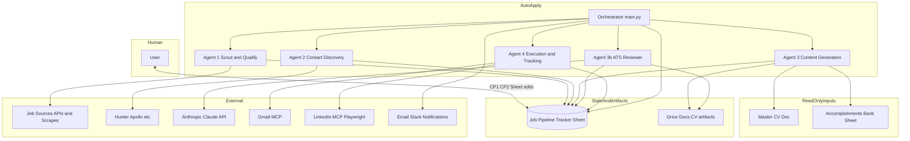

# System Context Diagram — AutoApply v1

Phase 0 artifact: high-level boundaries between orchestrator, agents, humans, and external systems.

## Textual Context

- **Human:** Reviews CP1/CP2, edits Sheet actions and approvals.
- **Orchestrator:** Scheduler-driven controller driving agents and checkpoints.
- **Agents 1–4 / 3b:** Domain workers reading/writing Pipeline Tracker per contracts.
- **Google Workspace:** Drive MCP + Sheets/Docs for pipeline state and CV artifacts.
- **Third-party APIs:** Job boards, enrichment, SerpAPI, Anthropic, optional Slack/email webhooks.
- **Automation:** Playwright for portals where permitted; manual queue when not.

## Mermaid Diagram

---

## Revision History

| Date | Change |
|------|--------|
| 2026-05-03 | Initial Phase 0 diagram |
